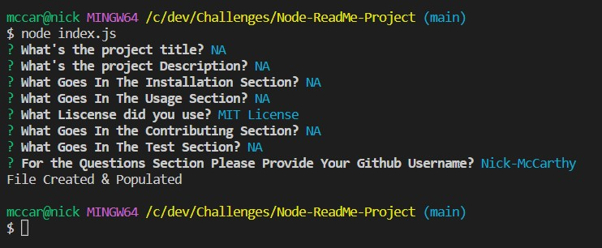
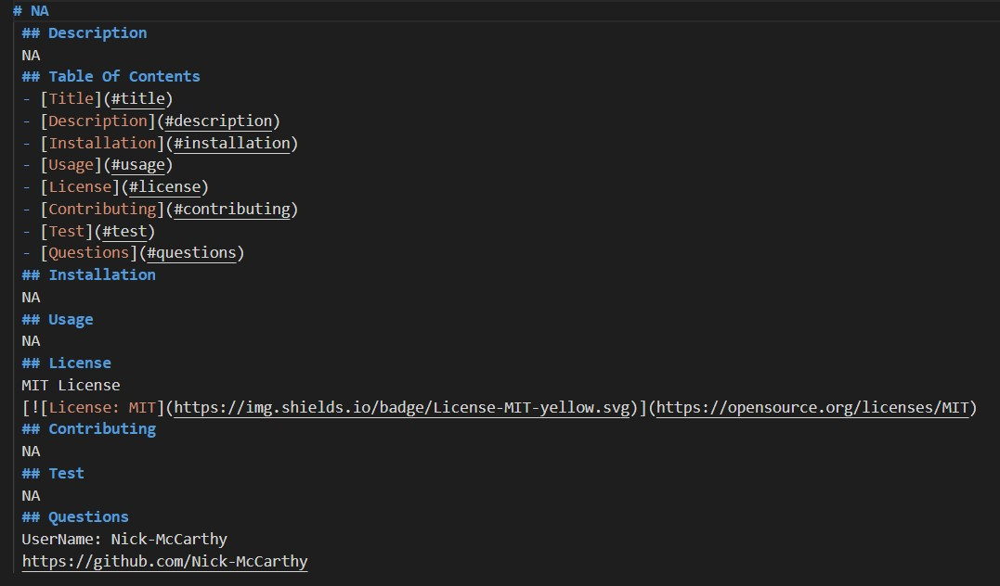

# ReadMe Generator 
 ## Description 
 Command Line application that generates a readme file in same directory. 
 ## Table Of Contents 
 - [Title](#title) 
 - [Description](#description) 
 - [Installation](#installation) 
 - [Usage](#usage) 
 - [License](#license) 
 - [Contributing](#contributing) 
 - [Test](#test) 
 - [Questions](#questions) 
 ## Installation 
 requires node and inquirer 8.2.4 
 ## Usage 
 run node index.js within the directory from command line. 
 caption: command prompts
 

 
caption: generated readme
 

 ## License 
 MIT License 
  
 ## Contributing 
 Nick McCarthy 
 ## Test 
 NA 
 ## Questions 
 UserName: Nick-McCarthy 
 https://github.com/Nick-McCarthy
